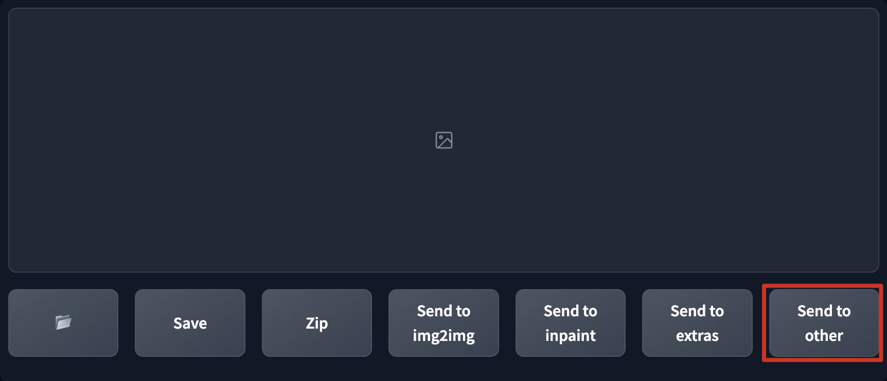

# DFLAME (Don't F**king Look At Me)
[[中文版]](./README_zh.md)  
Hide/show live preview and result gallery with one-click to fool those annoying prying eyes

## Screenshot
  

## Usage
This extension will add a fake button called `Send to other` to your WebUI.  
When you click the button, the live preview and result gallery will be hidden immediately until you click it again.

## Install
1. Go to SD WebUI's `extension` tab
2. Click `Install from URL` subtab
3. Paste `https://github.com/lihaoyun6/sd-webui-DFLAME` into the URL textbox
4. Click `Install` and wait for it to complete
5. Once completed, the WebUI needs to be reloaded

## Credits 
- [Stable Diffusion web UI](https://github.com/AUTOMATIC1111/stable-diffusion-webui) @AUTOMATIC1111  
