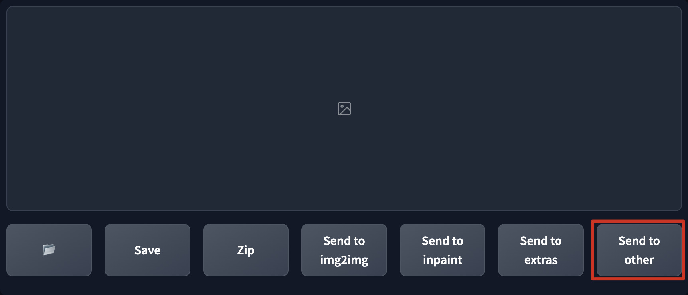

# DFLAME (Don't F**king Look At ME)
一键随时隐藏实时预览及输出图库, 帮助你躲避烦人的窥屏爱好者. 

## 截图
  

## 使用说明
此插件将会在WebUI界面中添加一个名为`Send to other`的伪装按钮, 点击此按钮就可以随时立即隐藏实时预览过程以及输出图库, 再次点击此按钮恢复显示.

## 安装
1. 前往 SD WebUI 的 `扩展` 标签页
2. 点击 `从网址安装` 子标签
3. 将 `https://github.com/lihaoyun6/sd-webui-DFLAME` 粘贴进网址输入框
4. 点击 `安装` 并等待完成
5. 提示安装成功后重载 WebUI 即可启用

## 鸣谢
- [Stable Diffusion web UI](https://github.com/AUTOMATIC1111/stable-diffusion-webui) @AUTOMATIC1111  
